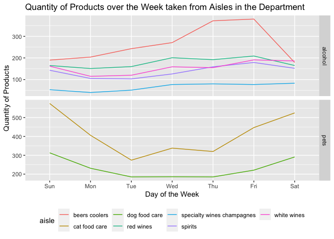
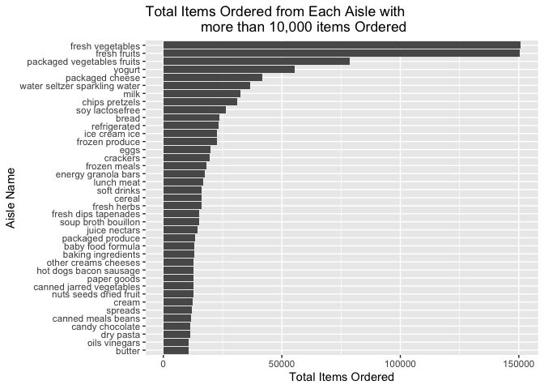

p8105\_hw3\_zv2138
================

``` r
library(tidyverse)
library(p8105.datasets)
library(lubridate)
library(kimisc)
```

# Problem 1

## Cleaning Instacart Data

``` r
data("instacart")
instacart = 
  instacart %>% 
    mutate(
      order_dow = order_dow + 1,
      order_dow = wday(order_dow, label = T)
   ) 
```

## Describing the Instacart Dataset

Write a short description of the dataset, noting the size and structure
of the data, describing some key variables, and giving illustrative
examples of observations.

The Instacart dataset has 1384617 observations with orders coming from
131209 costumers. There are 39123 products displayed in this dataset.
Some examples of these products include Bulgarian Yogurt, Organic 4%
Milk Fat Whole Milk Cottage Cheese, Organic Celery Hearts.

The dataset has 15 variables including the house of the day an order was
placed, the day of the week an order was placed, and the products in the
order with the aisle the product came form.

The day where the most orders are placed is Sun. The hour of the day
where the most orders are places is 14

The dataset includes 21 grocery store departments. Some examples of
these departments include dairy eggs, produce, canned goods.

## Problem 1 Illustrative Examples

``` r
instacart %>% 
  group_by(order_dow) %>% 
  ggplot(aes(x = order_dow, y = order_hour_of_day)) +
   geom_boxplot(aes(fill = order_dow), alpha = .5) +
   labs(
    title = "Hour of the Day when Orders are Placed ",
    x = "Order Day of the Week",
    y = "Order Hour of the Day",
  ) + 
    theme(legend.position = "none")
```

<!-- -->

``` r
instacart_alc_dept_dow = instacart %>% 
  filter(department == "alcohol") %>% 
  group_by(order_dow, aisle, department) %>% 
  summarise(total = n())
```

    ## `summarise()` has grouped output by 'order_dow', 'aisle'. You can override using the `.groups` argument.

``` r
instacart_alc_dept_dow %>% 
  ggplot(aes(x = order_dow, y = total, group = aisle, color = aisle)) + 
  geom_line() +
  theme(legend.position = "bottom") +
   labs(
    title = "Quantity of Orders over the Week taken from Aisles in the Alcohol Department",
    x = "Day of the Week",
    y = "Quantity of Orders",
  )
```

<!-- -->

## Problem 1 Questions

How many aisles are there, and which aisles are the most items ordered
from?

``` r
aisles = instacart %>% 
 count(aisle, sort = TRUE)
```

There are 134. The top 5 aisles where most items are ordered are from
fresh vegetables, fresh fruits, packaged vegetables fruits, yogurt,
packaged cheese

Make a plot that shows the number of items ordered in each aisle,
limiting this to aisles with more than 10000 items ordered. Arrange
aisles sensibly, and organize your plot so others can read it.

``` r
aisles %>% 
  filter(n > 10000) %>% 
  ggplot(aes(x = reorder(aisle, n), y = n)) + 
  geom_bar(stat='identity') + coord_flip() +
  ylab("Total Items Ordered") + xlab("Aisle Name") + 
  ggtitle("Total Items Ordered from Each Aisle") 
```

<!-- -->

Make a table showing the three most popular items in each of the aisles
“baking ingredients”, “dog food care”, and “packaged vegetables fruits”.
Include the number of times each item is ordered in your table.

``` r
instacart %>% 
  filter(aisle %in% c('baking ingredients', 'dog food care','packaged vegetables fruits')) %>% 
  count(product_name, aisle, sort = TRUE) %>% 
  group_by(aisle) %>% slice(1:3) %>% 
  knitr::kable()
```

| product\_name                                 | aisle                      |    n |
|:----------------------------------------------|:---------------------------|-----:|
| Light Brown Sugar                             | baking ingredients         |  499 |
| Pure Baking Soda                              | baking ingredients         |  387 |
| Cane Sugar                                    | baking ingredients         |  336 |
| Snack Sticks Chicken & Rice Recipe Dog Treats | dog food care              |   30 |
| Organix Chicken & Brown Rice Recipe           | dog food care              |   28 |
| Small Dog Biscuits                            | dog food care              |   26 |
| Organic Baby Spinach                          | packaged vegetables fruits | 9784 |
| Organic Raspberries                           | packaged vegetables fruits | 5546 |
| Organic Blueberries                           | packaged vegetables fruits | 4966 |

Make a table showing the mean hour of the day at which Pink Lady Apples
and Coffee Ice Cream are ordered on each day of the week; format this
table for human readers (i.e. produce a 2 x 7 table).

``` r
table = instacart %>% 
  filter(product_name %in% c('Pink Lady Apples', 'Coffee Ice Cream')) %>% 
  select(product_name, order_dow, order_hour_of_day) %>% 
  group_by(product_name, order_dow) %>% 
  mutate(mean_time_of_day = seconds.to.hms(mean(order_hour_of_day*60*60))) %>% 
  select(product_name, order_dow, mean_time_of_day) %>% 
  distinct() %>% 
  pivot_wider(product_name, names_from = "order_dow", values_from = "mean_time_of_day") 

table[, c("product_name","Sun","Mon","Tue","Wed","Thu","Fri","Sat")] %>% 
   knitr::kable()
```

| product\_name    | Sun      | Mon      | Tue      | Wed      | Thu      | Fri      | Sat      |
|:-----------------|:---------|:---------|:---------|:---------|:---------|:---------|:---------|
| Pink Lady Apples | 13:26:28 | 11:21:36 | 11:42:07 | 14:15:00 | 11:33:06 | 12:47:03 | 11:56:15 |
| Coffee Ice Cream | 13:46:27 | 14:18:56 | 15:22:51 | 15:19:05 | 15:13:02 | 12:15:47 | 13:50:00 |

# Problem 2

## Cleaning BRFSS SMART 2010

``` r
data(brfss_smart2010) 
brfss_smart2010 = brfss_smart2010 %>% 
  janitor::clean_names() 

brfss_subset = brfss_smart2010 %>%  
  filter(topic %in% "Overall Health") %>%
  filter(response %in% c("Poor","Fair","Good","Very good","Excellent")) %>%
  mutate(response = factor(response, ordered = TRUE, 
                       levels = c("Poor", "Fair", "Good", "Very good", "Excellent"))) %>% 
  mutate(locationdesc = gsub("^.{0,5}", "", locationdesc)) %>% 
  rename(state = locationabbr)
```

## Problem 2 Questions

In 2002, which states were observed at 7 or more locations? What about
in 2010?

``` r
states_02 = brfss_subset %>% 
  filter(year == '2002') %>% 
  select(locationdesc, state) %>% 
  unique() %>% 
  count(state)

states_02 = states_02 %>% 
  filter(n >= 7)

states_10 = brfss_subset %>% 
  filter(year == '2010') %>% 
  select(locationdesc, state) %>% 
  unique() %>% 
  count(state)

states_10 = states_10 %>% 
  filter(n >= 7)
```

In 2002, CT, FL, MA, NC, NJ, PA states were observed at 7 or more
locations. In 2010, CA, CO, FL, MA, MD, NC, NE, NJ, NY, OH, PA, SC, TX,
WA states were observed at 7 or more locations.

Spaghetti Plot

``` r
brfss_spaghetti = brfss_subset %>%
  filter(response == 'Excellent') %>% 
  group_by(state, year) %>% 
  mutate(average_data_value = mean(data_value, na.rm = TRUE)) %>% 
  select(year, state, average_data_value) %>% 
  unique()

ggplot(data = brfss_spaghetti, aes(x = year, y = average_data_value, group = state, color = state)) +
  geom_line() + 
  labs(
    title = "Average Data Value Over the Years by State",
    x = "Average Data Value",
    y = "Year",
  ) 
```

<!-- -->

Make a two-panel plot showing, for the years 2006, and 2010,
distribution of data\_value for responses (“Poor” to “Excellent”) among
locations in NY State.

``` r
brfss_ny = brfss_subset %>% 
  filter(year == "2006" | year == "2010", state == "NY") %>% 
  select(year, locationdesc, response, data_value)

brfss_ny %>% 
  ggplot(aes(x = data_value, fill = response)) + 
  geom_density(alpha = 0.4) + 
  facet_grid(year ~ .) +
  theme(legend.position = "bottom") +
   labs(
    x = "Average Data Value",
    y = "Density"
  )
```

<!-- -->

# Problem 3

## Load and Tidy the Accelerometer Data

``` r
accel_data_og = read_csv("./accel_data.csv") 
```

    ## Rows: 35 Columns: 1443

    ## ── Column specification ────────────────────────────────────────────────────────
    ## Delimiter: ","
    ## chr    (1): day
    ## dbl (1442): week, day_id, activity.1, activity.2, activity.3, activity.4, ac...

    ## 
    ## ℹ Use `spec()` to retrieve the full column specification for this data.
    ## ℹ Specify the column types or set `show_col_types = FALSE` to quiet this message.

``` r
accel_data = read_csv("./accel_data.csv") %>% 
  janitor::clean_names() %>% 
  pivot_longer(activity_1:activity_1440,
               names_to = "activity_minute",
               values_to = "data") %>% 
  mutate(activity_minute = gsub("^.{0,9}", "", activity_minute),
         activity_minute = as.numeric(activity_minute),
         day = factor(day, ordered = TRUE, 
                  levels = c("Sunday", "Monday", "Tuesday", "Wednesday", "Thursday", "Friday", "Saturday")),
         day_type = ifelse((day == c("Sunday", "Saturday")), "Weekend", "Weeday"))
```

    ## Rows: 35 Columns: 1443

    ## ── Column specification ────────────────────────────────────────────────────────
    ## Delimiter: ","
    ## chr    (1): day
    ## dbl (1442): week, day_id, activity.1, activity.2, activity.3, activity.4, ac...

    ## 
    ## ℹ Use `spec()` to retrieve the full column specification for this data.
    ## ℹ Specify the column types or set `show_col_types = FALSE` to quiet this message.

Using your tidied dataset, aggregate accross minutes to create a total
activity variable for each day, and create a table showing these totals.
Are any trends apparent?

``` r
total_activity = accel_data %>% 
  group_by(day_id) %>% 
  summarize(total_activity = sum(data)) 

knitr::kable(total_activity)
```

| day\_id | total\_activity |
|--------:|----------------:|
|       1 |       480542.62 |
|       2 |        78828.07 |
|       3 |       376254.00 |
|       4 |       631105.00 |
|       5 |       355923.64 |
|       6 |       307094.24 |
|       7 |       340115.01 |
|       8 |       568839.00 |
|       9 |       295431.00 |
|      10 |       607175.00 |
|      11 |       422018.00 |
|      12 |       474048.00 |
|      13 |       423245.00 |
|      14 |       440962.00 |
|      15 |       467420.00 |
|      16 |       685910.00 |
|      17 |       382928.00 |
|      18 |       467052.00 |
|      19 |       371230.00 |
|      20 |       381507.00 |
|      21 |       468869.00 |
|      22 |       154049.00 |
|      23 |       409450.00 |
|      24 |         1440.00 |
|      25 |       260617.00 |
|      26 |       340291.00 |
|      27 |       319568.00 |
|      28 |       434460.00 |
|      29 |       620860.00 |
|      30 |       389080.00 |
|      31 |         1440.00 |
|      32 |       138421.00 |
|      33 |       549658.00 |
|      34 |       367824.00 |
|      35 |       445366.00 |

``` r
ggplot(total_activity, aes(x = day_id, y = total_activity)) + geom_line()
```

<!-- -->

Make a single-panel plot that shows the 24-hour activity time courses
for each day and use color to indicate day of the week.

``` r
ggplot(data = accel_data, aes(x = activity_minute, y = data, group = day_id, color = day)) +
  geom_line() + 
  facet_grid(week ~ .) +
  labs(
    title = "Average Data Value Over the Years by State",
    x = "Activity Minute",
    y = "Activtiy Value",
  ) 
```

<!-- -->
